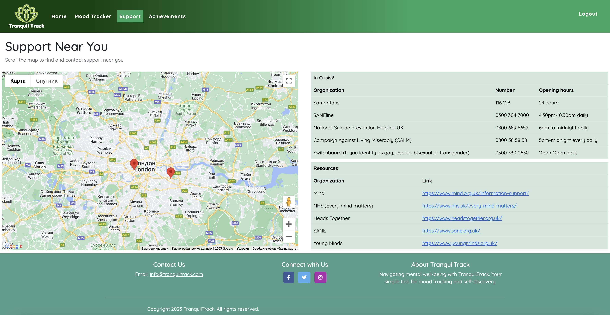

# TranquilTrack


View the live site [here](https://tranquil-track-0489475d301b.herokuapp.com/).

## Introduction

**TranquilTrack** is a user-friendly application designed to help you monitor and analyse your mood patterns over time. Whether you're interested in self-reflection, mental health awareness, or simply understanding the factors influencing your well-being, Tranquil Track is here to assist you.

### Project Goals

The primary goal of Tranquil Track is to create a user-friendly and impactful mood-tracking application. These goals include:

1. **Comprehensive Well-Being:** Develop a platform that goes beyond traditional mood tracking, incorporating features to log sleep patterns, physical activities, and overall health indicators.

2. **Geolocation Support:** Provide users with valuable information about nearby medical centres and professionals offering mental health support and routine check-ups.

3. **Motivational Rewards:** Implement a reward system within the app to encourage users to maintain consistent engagement, promoting positive mental health habits.

4. **Continuous Reminders:** Design and integrate a reminder system that ensures users are consistently aware of the importance of both mental and physical well-being.

These goals collectively contribute to creating a holistic and supportive environment for users, promoting mental health awareness and well-being.

## Agile Development

### User Stories

User Stories were created and prioritised with the Kanban Board in Github Projects - [here](https://github.com/users/KTC96/projects/9/views/1).

## User Experience (UX) & User Interface (UI)

### Wireframes

**Login page**


Mood Journal page, Home page, Achievements page


Support page


### Site Map


### Data Schema


### Colour Scheme

A scheme was chosen featuring mainly blues and green, to invoke a mood of health and relaxation.


### Typography

Google Fonts was used to import the ‘Quicksand’ font.


### Tranquil Track Logo


The Tranquil Track logo is characterised by its soothing green colour, harmonising with the symbolic lotus design. Green, representing nature and renewal, has been chosen intentionally for its positive impact on mental well-being.

**Key Elements:**

- **Colour:** The calm green colour is inspired by nature, promoting feelings of balance and calmness. Green is known to have a positive impact on mood, making it a perfect fit for Tranquil Track.
- **Design:** The lotus symbolizes growth and resilience, making it an uplifting addition to the logo. Tranquil Track encourages you on your path to a brighter mood.

## Features

- **Landing Page**: The user is presented with a Log In / Sign Up page.
    
    
    
    
    
- **Daily Inspiration:** Every time you open the app, receive a fresh dose of inspiration with motivational quotes. Start your day on a positive note and keep the good vibes flowing.
    
    
    
    **Interactive Charts:** Draw and customise charts to visually represent your mood and sleep data.
    
    
    
- **Mood Journal:** Keep track of your emotions with our intuitive mood journal. Log your feelings and see graphical representations of your mood trends over the past months.
    
    
    
- **Rewards and Achievements:** Earn rewards for consistent journaling and recognising patterns in your mood. Stay motivated with a system that celebrates your progress.


- **Geolocation Assistance:** Based on your location, Tranquil Track identifies nearby places where you can access professional support. Your mental well-being is our priority.
    
    
    
- **Custom 403, 404 & 500 Error Pages**


## Features to Implement in the Future

- A chatbot trained with data on mental and physical health.
- Collaborate with healthcare providers to integrate features that remind users of important health screenings or check-ups.
- Provide resources and information about preventive healthcare practices.
- Add more mental and physical health resources to the Support page.
- Add success message alerts across all site functionality.
- Test Django code with Python Linter and implement suggestions.
- Test JavaScript with JSHint and implement suggestions.
- Test HTML with WC3 Markup Validator
- Generate further Lighthouse reports
- Clinic Partnerships: We plan to explore partnerships with clinics to provide enhanced mental health support.
- Premium Services: In the future, we aim to introduce premium features, including advanced analytics and personalised insights.

## Technologies Used

### Languages, Frameworks and Applications Used

- Languages:
    - Python
    - JavaScript
    - HTML5
    - CSS3
- Framework:
    - Django
- Database:
    - PostgreSQL
- [Git](https://git-scm.com/) - for version control.
- [GitHub](https://github.com/) - for storing the project.
- [ElephantSQL](https://www.elephantsql.com/) - PostgreSQL as a service.
- [Heroku](https://www.heroku.com/) - to deploy the application.
- [Cloudinary](https://cloudinary.com/) - to host the static files and image uploads.
- [Chrome Developer Tools](https://developer.chrome.com/docs/devtools/) - to test responsiveness and generate Lighthouse reports.
- [Google Fonts](https://fonts.google.com/) - to import the site font, ‘Quicksand’.
- [Bootstrap](https://getbootstrap.com/) - for site styles.
- [Font Awesome](https://fontawesome.com/) - for all the site icons.
- [Abobe Illustrator](https://www.adobe.com/) & [ICO Converter](https://www.icoconverter.com/) - for the favicon.
- [Coolers](https://coolers.co/) - for an overview of the chosen colour palette.
- [Am I Responsive](https://ui.dev/amiresponsive) - to create the responsive demo image at the top of the Readme.
- [Lucidchart](https://www.lucidchart.com/pages/) - to create the database schemas.
- [W3C CSS Validator](https://jigsaw.w3.org/css-validator) - to test the CSS code.

### APIs Used

- [Google Maps JavaScript API](https://developers.google.com/maps/documentation/javascript/overview) - for the Support page map.
- [Quotable API](https://github.com/lukePeavey/quotable) - quote generator for the Affirmation page, using tags: ‘inspirational’, ‘motivational ‘

### Python Packages Used

- [django-allauth](https://docs.allauth.org/en/latest/index.html) - for user authentication.
- [gunicorn](https://gunicorn.org/) - as the HTTP server that allows Django to run on Heroku.
- [psycopg2](https://pypi.org/project/psycopg2/) - as the PostgreSQL database adapter for Python.
- [dj_database_url](https://pypi.org/project/dj-database-url/) - to allow the use of the `DATABASE_URL` environment variable inside Django.
- [django_summernote](https://github.com/summernote/django-summernote) - as the WYSIWYG editor for forms.
- [django-crispy-forms](https://django-crispy-forms.readthedocs.io/en/latest/) - for rich text editing of forms.

## Testing

### Automated Testing

**CSS Validation:**

CSS Was tested with the WC3 CSS Validator


**Google Lighthouse Reports:**

The home page (desktop) - 


## Bugs

### Unfixed Bugs

---

When you try adding text to the content section of the mood tracker it extends beyond the container:


---

## Deployment

### Forking the GitHub Repository

By forking the GitHub Repository we make a copy of the original repository on our GitHub account to view and/or make changes without affecting the original repository by using the following steps...

1. Log in to GitHub and locate the [GitHub Repository](https://github.com/timgoalen/command-line-coffee)
2. At the top right of the Repository, just below the GitHub navbar, click on the "Fork" Button.
3. You should now have a copy of the original repository in your GitHub account.

### Making a Local Clone

1. Log in to GitHub and locate the [GitHub Repository](https://github.com/timgoalen/command-line-coffee)
2. Above the list of files, click "Code".
3. To clone the repository using HTTPS, under "Clone with HTTPS", copy the link.
4. Open Git Bash
5. Change the current working directory to the location where you want the cloned directory to be made.
6. Type `git clone`, and then paste the URL you copied in Step 3.

```
$ git clone https://github.com/YOUR-USERNAME/YOUR-REPOSITORY

```

1. Press Enter. Your local clone will be created.

```
$ git clone https://github.com/YOUR-USERNAME/YOUR-REPOSITORY
> Cloning into `CI-Clone`...
> remote: Counting objects: 10, done.
> remote: Compressing objects: 100% (8/8), done.
> remove: Total 10 (delta 1), reused 10 (delta 1)
> Unpacking objects: 100% (10/10), done.

```

Click [Here](https://help.github.com/en/github/creating-cloning-and-archiving-repositories/cloning-a-repository#cloning-a-repository-to-github-desktop) to retrieve pictures for some of the buttons and more detailed explanations of the above process.

1. For changes you've made to reflect on the live site*:
    - Type `git add <files changed>`
    - Type `git commit -m <description of change>`
    - Type `git push`
    - In Heroku, after pushing to Github - if 'automatic deploys' aren't enabled, manually deploy by clicking 'Deploy Branch' in the Manual Deploy section.

### Set up the Google Maps API

Follow the steps outlined in the Google [documentation](https://developers.google.com/maps/get-started), to:

- Create a Google Cloud account
- Create a project
- Get a Google Maps API key
- Enable the Maps API and Places API

### Cloudinary

1. Create a [Cloudinary](http://cloudinary.com) account, to host the static files.
2. Copy your ‘API Environment variable’**.**

### ElephantSQL

1. Create an [ElephantSQL](https://www.elephantsql.com/) account.
2. Create a new instance.
3. Copy the database URL.

You will also need to add the database to your Django [settings.py](http://seetings.py) file:

`DATABASES = {`

`'default': dj_database_url.parse(os.environ.get("DATABASE_URL"))`

`}`

---

### Deploy to Heroku

1. Create a [Heroku](https://www.heroku.com/) account.
2. In the dashboard, click on ‘Create new app’ from the ‘New’ dropdown menu in the top right.
3. Name the app and choose a region.
4. In the ‘Settings’ tab, click on 'Reveal Config Vars’.
5. Enter the details for these Variables [you will also need these variables in your ‘env.py’ file for local use]:
    1. CLOUDINARY_URL
    2. DATABASE_URL (from ElephantSQL)
    3. GOOGLE_MAPS_API_KEY
    4. SECRET_KEY (from Django)
6. In the 'Buildpacks' section click 'Add buildpack'.
7. Select ‘Python’, and click 'save changes'.
8. In the 'Deploy' tab, select GitHub as the deployment method, and click 'Connect to GitHub'.
9. In the 'App Connected to GitHub' section, search for the GitHub repository name, select it then click 'connect'.
10. Finally, either click ‘Enable Automatic Deploys’, or ‘Deploy Branch’ in the ‘Manual deploy’ section.

By forking the GitHub Repository we make a copy of the original repository on our GitHub account to view and/or make changes without affecting the original repository by using the following steps...

1. Log in to GitHub and locate the [GitHub Repository](https://github.com/timgoalen/command-line-coffee)
2. At the top right of the Repository, just below the GitHub navbar, click on the "Fork" Button.
3. You should now have a copy of the original repository in your GitHub account.

## Credits

### Content

Logo:


### Code

https://www.hacksoft.io/blog/quick-and-dirty-django-passing-data-to-javascript-without-ajax - used to pass Django data to JavaScript via a JSON tag in the template.

### Acknowledgements

- [Code Institute](https://codeinstitute.net/) and [Trust in SODA](https://www.trustinsoda.com/) for organising the hackathon!

### Hack Team Members

- Douglas Maxton
- Tim Goalen
- Ganiat Badara
- Artem Bryzh
- Amy Lewis
- Kyle Clow
- Veronika Nemergutova